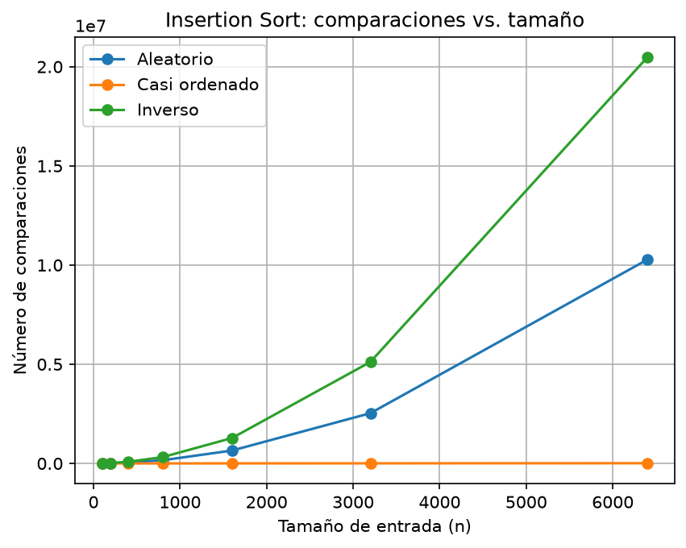
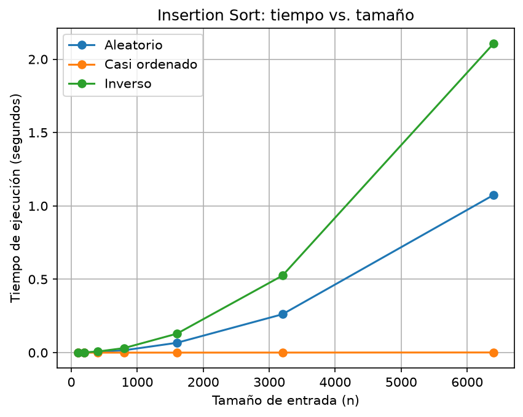
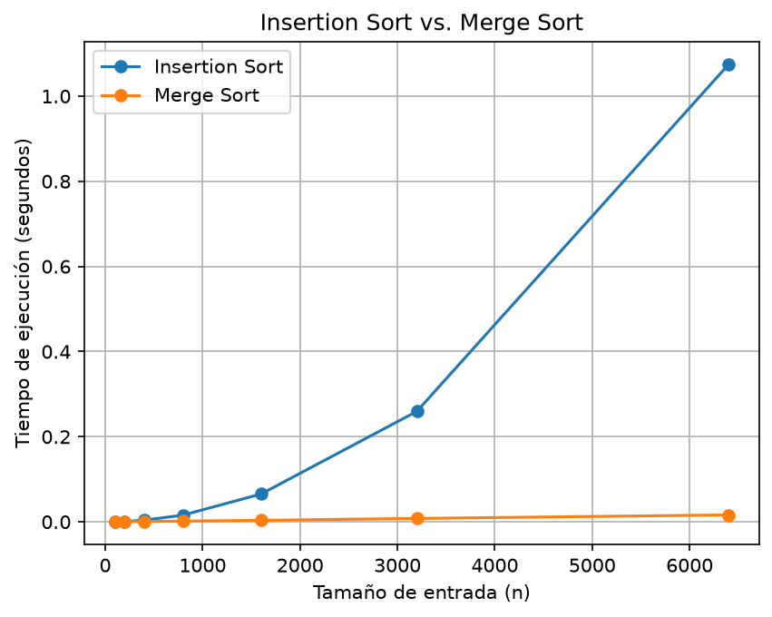

# Laboratorio 1 — Fundamentos, complejidad y recurrencias

**Estudiante:** Samuel Cristobal Cuello Duque
**Curso:** Análisis de Algoritmos
**Laboratorio:** Fundamentos, complejidad y recurrencias

---

## Reproducción del laboratorio

Para ejecutar el laboratorio se requiere Python 3 y la biblioteca `matplotlib`.

Desde la carpeta `lab1-fundamentos-complejidad-recurrencias` se ejecutan los experimentos con:

```bash
python parte3_casos.py
```

Este programa ejecuta las pruebas de `insertion_sort` sobre los tres escenarios y genera:

* `graficas/parte3_comparaciones.png`
* `graficas/parte3_tiempo.png`

Para ejecutar la comparación entre `insertion_sort` y `merge_sort` se utiliza:

```bash
python parte4_complejidad.py
```

Este programa genera:

* `graficas/parte4_tiempo.png`

La generación de los datos se realiza antes de iniciar la medición del tiempo, por lo que el tiempo registrado corresponde únicamente a la ejecución del algoritmo de ordenamiento.

---

# Parte 1 — Corrección vs. eficiencia

La **corrección** de un algoritmo significa que este produce el resultado esperado para todas las entradas válidas. En el caso de la plataforma Tamiza, un algoritmo de ordenamiento es correcto si organiza los registros de acuerdo con el criterio solicitado, es decir, de mayor a menor índice de riesgo.

La **eficiencia** está relacionada con los recursos que necesita el algoritmo para obtener ese resultado, principalmente el tiempo de ejecución y la memoria utilizada. Por lo tanto, un algoritmo puede ser correcto y aun así no ser apropiado para un problema real si tarda demasiado en ejecutarse.

En Tamiza existe una restricción estricta de tiempo, ya que el procesamiento debe realizarse entre las 2:00 a. m. y las 6:00 a. m. Esto significa que existe una ventana máxima de cuatro horas para procesar y ordenar los registros. Si el algoritmo produce una lista correctamente ordenada, pero no termina dentro de ese intervalo, no cumple con las necesidades de la plataforma.

Utilizar un servidor con el doble de velocidad puede disminuir el tiempo de ejecución, pero no modifica la complejidad del algoritmo. Si la cantidad de registros continúa creciendo, un algoritmo con comportamiento cuadrático seguirá teniendo un crecimiento considerable en el número de operaciones.

Un ejemplo de algoritmo correcto pero poco viable sería `insertion_sort` cuando se utiliza sobre una cantidad muy grande de registros. El algoritmo puede ordenar correctamente los datos, pero en entradas desfavorables necesita una gran cantidad de comparaciones y desplazamientos. Por esta razón, para Tamiza no es suficiente con verificar que el algoritmo sea correcto; también es necesario seleccionar una solución que sea eficiente y pueda cumplir la ventana de procesamiento establecida.

---

# Parte 2 — Responsabilidad ambiental y ética

La eficiencia de un algoritmo también tiene relación con el consumo de recursos tecnológicos. Un algoritmo que necesita más tiempo de procesamiento mantiene los equipos trabajando durante más tiempo y puede aumentar el consumo de energía. Cuando se procesan grandes cantidades de información de manera frecuente, esta diferencia puede ser significativa.

Un primer daño concreto es el **mayor consumo energético** debido a que los servidores necesitan permanecer ejecutando el proceso durante más tiempo. El costo directo lo asumiría la organización encargada de la plataforma mediante un mayor consumo de recursos de infraestructura.

Un segundo daño es el **uso ineficiente de los recursos tecnológicos**. Comprar hardware más potente para compensar las deficiencias de un algoritmo puede aumentar los costos de infraestructura sin solucionar la causa principal del problema. Este costo también recaería sobre la organización y, en el caso de una entidad pública, sobre los recursos destinados a la prestación del servicio.

También existe un aspecto ético importante. En Tamiza, el orden de los registros determina quién debe ser contactado primero de acuerdo con su índice de riesgo. Una lista incompleta, incorrectamente ordenada o que no termine dentro de la ventana de procesamiento podría provocar que personas con mayor riesgo sean contactadas después de personas con menor prioridad.

Por esta razón, la eficiencia del algoritmo no solamente representa una decisión técnica. También puede tener consecuencias sobre el uso responsable de los recursos y sobre las personas que dependen de los resultados generados por el sistema.

---

# Parte 3 — Casos de entrada e instrumentación

## 3.1 Mejor, peor y promedio caso

Para un tamaño de entrada fijo `n`, el **mejor caso** representa la entrada que requiere la menor cantidad de operaciones o comparaciones.

El **peor caso** representa la entrada que requiere la mayor cantidad de operaciones o comparaciones.

El **caso promedio** representa el comportamiento esperado considerando diferentes entradas posibles del mismo tamaño.

Los tres escenarios utilizados en el laboratorio son:

* **Escenario A — Aleatorio:** los registros se encuentran en un orden sin relación con el orden requerido.
* **Escenario B — Casi ordenado:** el 98 % de los registros ya se encuentra ordenado y el 2 % restante corresponde a nuevos resultados agregados al final.
* **Escenario C — Inverso:** los registros se encuentran organizados en el sentido contrario al orden requerido.

Debido a que Tamiza tiene una restricción estricta de cuatro horas, para producción no sería adecuado diseñar la solución basándose únicamente en el mejor caso. Se debe considerar principalmente el peor caso para garantizar que el procesamiento pueda terminar dentro de la ventana disponible.

---

## 3.2 Predicción antes de medir

Antes de realizar las mediciones se esperaba que `insertion_sort` presentara diferentes comportamientos según el escenario.

En el **escenario A (aleatorio)** se esperaba un comportamiento intermedio porque los elementos no tienen un orden previo definido.

En el **escenario B (casi ordenado)** se esperaba el mejor comportamiento, debido a que la mayor parte de los datos ya se encuentra en el orden requerido y solamente una pequeña parte necesita ser procesada.

En el **escenario C (inverso)** se esperaba el peor comportamiento, porque los elementos se encuentran organizados de manera contraria al orden requerido y el algoritmo necesita realizar una gran cantidad de comparaciones y desplazamientos.

---

## 3.3 Resultados de las comparaciones

Las pruebas se realizaron con los tamaños:

`100, 200, 400, 800, 1600, 3200 y 6400`.

Los resultados obtenidos fueron:

| Tamaño `n` |  Aleatorio | Casi ordenado |    Inverso |
| ---------: | ---------: | ------------: | ---------: |
|        100 |      2.542 |           100 |      4.950 |
|        200 |      9.970 |           203 |     19.900 |
|        400 |     40.436 |           417 |     79.800 |
|        800 |    160.484 |           866 |    319.600 |
|      1.600 |    648.481 |         1.851 |  1.279.200 |
|      3.200 |  2.533.103 |         4.172 |  5.118.400 |
|      6.400 | 10.276.753 |        10.277 | 20.476.800 |

Los resultados muestran que el escenario **inverso** requiere la mayor cantidad de comparaciones. Para `n = 6400` se realizaron **20.476.800 comparaciones**.

El escenario **aleatorio** presentó un resultado intermedio, con **10.276.753 comparaciones** para `n = 6400`.

El escenario **casi ordenado** fue considerablemente más eficiente. Para `n = 6400` solamente se realizaron **10.277 comparaciones**.

Estos resultados coinciden con la predicción inicial. El escenario casi ordenado es el más favorable para `insertion_sort`, mientras que el escenario inverso es el más costoso.



---

## 3.4 Resultados de tiempo

Los tiempos obtenidos fueron:

| Tamaño `n` | Aleatorio (s) | Casi ordenado (s) | Inverso (s) |
| ---------: | ------------: | ----------------: | ----------: |
|        100 |      0.000363 |          0.000012 |    0.000459 |
|        200 |      0.001024 |          0.000020 |    0.001826 |
|        400 |      0.003918 |          0.000047 |    0.007599 |
|        800 |      0.016087 |          0.000100 |    0.030986 |
|      1.600 |      0.066987 |          0.000213 |    0.129040 |
|      3.200 |      0.261485 |          0.000485 |    0.524873 |
|      6.400 |      1.074454 |          0.001209 |    2.106491 |

El escenario **inverso** presentó los mayores tiempos de ejecución. Para `n = 6400`, `insertion_sort` tardó **2.106491 segundos**.

El escenario **aleatorio** tardó **1.074454 segundos** para el mismo tamaño.

Por otra parte, el escenario **casi ordenado** solamente tardó **0.001209 segundos** para `n = 6400`.

La diferencia entre los escenarios se hace mucho más evidente a medida que aumenta el tamaño de la entrada. Esto demuestra experimentalmente que el orden inicial de los datos tiene una influencia importante sobre el rendimiento de `insertion_sort`.



---

## 3.5 Relación entre los resultados y la teoría

Los resultados obtenidos son coherentes con la complejidad teórica de `insertion_sort`.

En el mejor caso, cuando los datos ya se encuentran ordenados de acuerdo con el criterio requerido, el algoritmo realiza aproximadamente una comparación por elemento. Por esto:

**Mejor caso: Θ(n)**

Los datos casi ordenados muestran este comportamiento. Por ejemplo, al pasar de `n = 3200` a `n = 6400`, las comparaciones aumentan de 4.172 a 10.277, manteniéndose muy por debajo de los valores de los escenarios aleatorio e inverso.

En el peor caso, cuando los datos están en el orden contrario, el algoritmo necesita realizar aproximadamente:

**n(n - 1) / 2**

comparaciones.

Para `n = 6400`:

**6400 × 6399 / 2 = 20.476.800**

que coincide exactamente con las comparaciones obtenidas experimentalmente para el escenario inverso.

Por lo tanto:

**Peor caso: Θ(n²)**

El escenario aleatorio también presenta un crecimiento cuadrático en promedio:

**Caso promedio: Θ(n²)**

Los resultados experimentales permiten comprobar que el comportamiento de `insertion_sort` depende considerablemente de la distribución inicial de los datos.

---

# Parte 4 — Complejidad y comparación de algoritmos

## 4.1 Complejidad de Merge Sort

Para `merge_sort` se tiene la recurrencia:

**T(n) = 2T(n/2) + Θ(n)**

La expresión indica que el problema se divide en dos subproblemas de tamaño `n/2` y posteriormente se realiza una operación de combinación con costo lineal.

Mediante un árbol de recurrencia:

* Nivel 0: `Θ(n)`
* Nivel 1: `2 · Θ(n/2) = Θ(n)`
* Nivel 2: `4 · Θ(n/4) = Θ(n)`
* Nivel 3: `8 · Θ(n/8) = Θ(n)`
* ...
* Último nivel: aproximadamente `n` subproblemas de tamaño 1.

Cada nivel tiene un costo total de `Θ(n)`.

La cantidad de niveles es aproximadamente:

**log₂(n)**

Por lo tanto:

**T(n) = Θ(n) · Θ(log n)**

Finalmente:

**T(n) = Θ(n log n)**

Así, `merge_sort` presenta un crecimiento asintótico menor que `insertion_sort` en entradas grandes.

---

## 4.2 Complejidad de Insertion Sort

En el mejor caso, los datos ya están ordenados de acuerdo con el criterio requerido. Se realiza una comparación por cada elemento después del primero:

**T(n) = n - 1**

Por lo tanto:

**T(n) = Θ(n)**

En el peor caso, cada nuevo elemento debe compararse con todos los elementos anteriores. La cantidad de comparaciones es:

**1 + 2 + 3 + ... + (n - 1)**

Esta suma corresponde a:

**n(n - 1) / 2**

Por lo tanto:

**T(n) = Θ(n²)**

En el caso promedio también se obtiene un comportamiento cuadrático:

**T(n) = Θ(n²)**

### Tabla comparativa

| Algoritmo      | Mejor caso | Caso promedio | Peor caso  |
| -------------- | ---------- | ------------- | ---------- |
| Insertion Sort | Θ(n)       | Θ(n²)         | Θ(n²)      |
| Merge Sort     | Θ(n log n) | Θ(n log n)    | Θ(n log n) |

---

## 4.3 Comparación experimental

Se compararon `insertion_sort` y `merge_sort` utilizando el escenario aleatorio y los mismos tamaños de entrada.

Los resultados fueron:

| Tamaño `n` | Insertion Sort (s) | Merge Sort (s) |
| ---------: | -----------------: | -------------: |
|        100 |           0.000244 |       0.000166 |
|        200 |           0.000921 |       0.000344 |
|        400 |           0.003771 |       0.000753 |
|        800 |           0.015894 |       0.001673 |
|      1.600 |           0.065387 |       0.003601 |
|      3.200 |           0.259574 |       0.007969 |
|      6.400 |           1.074403 |       0.016237 |

Los resultados muestran una diferencia cada vez mayor a medida que aumenta el tamaño de entrada.

Para `n = 6400`, `insertion_sort` tardó **1.074403 segundos**, mientras que `merge_sort` tardó **0.016237 segundos**.

Por lo tanto, en esta prueba `merge_sort` fue aproximadamente **66 veces más rápido** que `insertion_sort` para `n = 6400`.



Las pequeñas diferencias que pueden aparecer en tamaños pequeños no contradicen la teoría. En estas escalas pueden influir factores como el sistema operativo, otros procesos ejecutándose en el equipo, la memoria y los costos internos de Python. A medida que aumenta `n`, el efecto de la complejidad algorítmica se vuelve más evidente.

---

# Parte 4.3 — Concepto técnico para el equipo de ingeniería

Para la plataforma Tamiza se recomienda utilizar **merge sort** como algoritmo de ordenamiento para el procesamiento de los registros de riesgo.

La principal razón es su complejidad temporal. `insertion_sort` presenta un comportamiento promedio y de peor caso de Θ(n²), mientras que `merge_sort` presenta un comportamiento de Θ(n log n). Esta diferencia es especialmente importante porque la plataforma debe procesar aproximadamente 1,2 millones de registros y cuenta con una ventana estricta de cuatro horas.

Las mediciones realizadas permiten observar esta diferencia incluso con tamaños mucho menores. Para `n = 6400`, `insertion_sort` tardó **1.074403 segundos**, mientras que `merge_sort` tardó **0.016237 segundos**. Esto significa que, en esta prueba, `merge_sort` fue aproximadamente 66 veces más rápido.

La estimación para 1,2 millones de registros debe considerarse una **extrapolación y no una medición directa**, porque las pruebas realizadas solamente llegaron hasta 6400 registros. Sin embargo, el comportamiento observado y las complejidades teóricas permiten anticipar que la diferencia entre ambos algoritmos aumentaría considerablemente al incrementar el tamaño de entrada.

Por esta razón, no se considera que simplemente duplicar la velocidad del servidor sea la solución principal. Aunque un hardware más rápido puede reducir los tiempos de ejecución, no cambia la complejidad del algoritmo. Un algoritmo Θ(n²) continuará teniendo un crecimiento mucho mayor que uno Θ(n log n) cuando aumente la cantidad de registros.

`merge_sort` tiene como desventaja que requiere memoria adicional para realizar la combinación de las listas. Sin embargo, esta desventaja resulta razonable frente a la mejora de tiempo obtenida en las pruebas. Además, su comportamiento es más predecible para diferentes tipos de entrada.

Desde el punto de vista del mantenimiento y el riesgo, utilizar un algoritmo con mejor comportamiento asintótico disminuye la dependencia de incrementar constantemente la capacidad del hardware. Esto resulta importante para una plataforma que puede aumentar su volumen de registros con el tiempo.

En conclusión, se recomienda reemplazar `insertion_sort` por `merge_sort` y posteriormente realizar una prueba de carga con una cantidad de registros cercana al volumen real de producción. La decisión debe centrarse principalmente en mejorar la solución algorítmica y utilizar el hardware como complemento, no como sustituto de una elección algorítmica adecuada.

---

# Conclusión general

El laboratorio permitió comprobar experimentalmente la importancia de analizar tanto la corrección como la eficiencia de un algoritmo.

En la Parte 3 se observó que `insertion_sort` presenta comportamientos muy diferentes dependiendo del orden inicial de los datos. El escenario casi ordenado fue el más favorable, con solamente **10.277 comparaciones y 0.001209 segundos** para `n = 6400`. En contraste, el escenario inverso alcanzó **20.476.800 comparaciones y 2.106491 segundos** para el mismo tamaño.

Los resultados también coincidieron con la teoría: `insertion_sort` presenta un mejor caso de Θ(n), pero un caso promedio y peor caso de Θ(n²).

En la Parte 4, la comparación experimental mostró una ventaja clara de `merge_sort`. Para `n = 6400`, `insertion_sort` tardó **1.074403 segundos**, mientras que `merge_sort` tardó **0.016237 segundos**, aproximadamente 66 veces menos tiempo.

Por lo tanto, considerando el volumen de datos de Tamiza y la restricción de cuatro horas, `merge_sort` es una alternativa más adecuada que `insertion_sort`. El análisis demuestra que mejorar la complejidad del algoritmo es una decisión más importante que depender únicamente de aumentar la velocidad del hardware.
