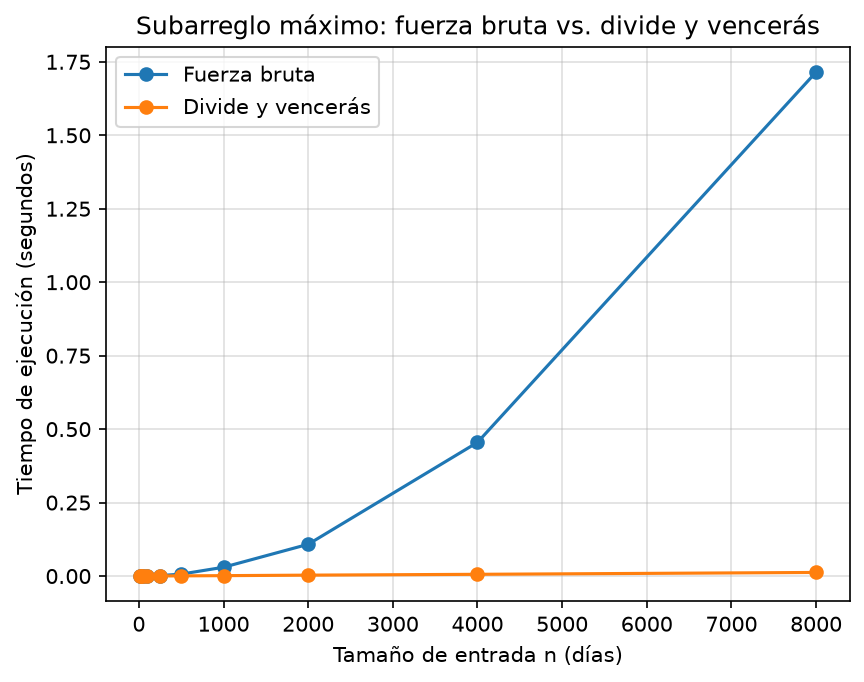
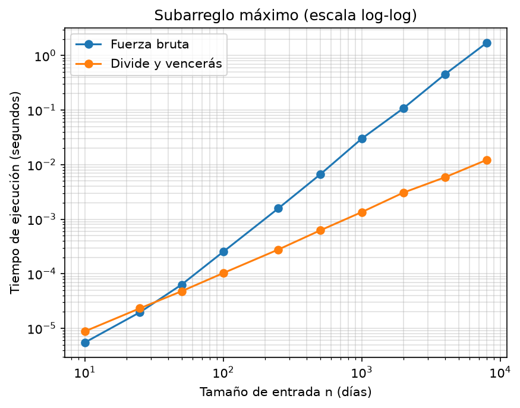

# Laboratorio 2 — Dividir y vencer

**Estudiante:** Samuel Cristobal Cuello Duque
**Curso:** Análisis de Algoritmos 190304006-1
**Laboratorio:** Laboratorio evaluativo 02 — Dividir y vencer (subarreglo máximo)

---

# Instrucciones de reproducción

El laboratorio usa Python 3 y `matplotlib`, registrado en el `requirements.txt` de la raíz del repositorio.

```text
curso-analisis-algoritmos/
└── lab2-divide-y-vencer/
    ├── README.md
    ├── subarreglo.py
    ├── pruebas.py
    ├── medicion.py
    └── graficas/
        ├── tiempo_vs_n.png
        └── tiempo_vs_n_log.png
```

Desde la raíz del repositorio (`curso-analisis-algoritmos/`), se crea y activa el entorno virtual:

```bash
python -m venv .venv
```

En Git Bash:

```bash
source .venv/Scripts/activate
```

En Windows PowerShell:

```powershell
.venv\Scripts\Activate.ps1
```

Luego se instalan las dependencias y se entra a la carpeta del laboratorio:

```bash
python -m pip install -r requirements.txt
cd lab2-divide-y-vencer
```

Para ejecutar las pruebas (Parte 1):

```bash
python pruebas.py
```

Para ejecutar la medición y generar las gráficas (Parte 2):

```bash
python medicion.py
```

`medicion.py` imprime en consola la tabla de tiempos y guarda `graficas/tiempo_vs_n.png` y `graficas/tiempo_vs_n_log.png`.

---

# Parte 1 — Implementación y verificación

**Código:** [subarreglo.py](subarreglo.py) · [pruebas.py](pruebas.py)

En [subarreglo.py](subarreglo.py) están las tres funciones:

* `subarreglo_fuerza_bruta`: prueba todos los pares `(i, j)` y acumula la suma dentro del ciclo interno, en vez de recalcularla desde cero para cada par.
* `suma_cruzada`: recorre la mitad izquierda desde `medio` hacia `inicio` y la mitad derecha desde `medio + 1` hacia `fin`, y se queda con la mejor suma de cada lado. El tramo siempre incluye al menos un elemento de cada mitad.
* `subarreglo_maximo`: el caso base es `inicio == fin`. Si no, resuelve recursivamente `inicio..medio` y `medio + 1..fin`, calcula el caso cruzado y devuelve el mejor de los tres. No llama a la fuerza bruta.

Ninguna función modifica la lista: trabajan solo con índices, sin copiar ni recortar la lista.

La verificación está en [pruebas.py](pruebas.py), un script con `assert` que compara sumas, no índices, porque puede haber varios tramos con la misma suma máxima. Cubre estos casos:

| Caso | Entrada | Suma esperada |
| --- | --- | ---: |
| Serie de ocho días de la situación problema | `[-3, 5, -2, 8, -6, 3, 9, -4]` | 17 (días 2 a 7) |
| Un solo elemento | `[7]`, `[-7]`, `[0]` | el mismo elemento |
| Todos negativos | `[-8, -3, -6, -2, -5, -9]` | −2 |
| Todos positivos | `[4, 1, 7, 3, 2, 6]` | 23 (toda la serie) |
| El mejor tramo cruza el punto medio | `[-10, -10, 5, 6, 7, 8, -10, -10]` | 26 |
| Listas aleatorias (semilla 2026) | 30 listas de tamaño 1 a 60, valores en [−100, 100] | igual en ambas funciones |

En el caso cruzado también se llama a `suma_cruzada` directamente. Además se comprueba que cada mitad por separado da menos (11 y 15), así que el resultado de 26 solo puede salir del caso cruzado. Hay otra prueba en la que ambos lados son negativos, para confirmar que `suma_cruzada` toma igual un elemento de cada lado. En las listas aleatorias se verifica además que la lista no cambie después de la llamada y que la suma de `valores[inicio..fin]` coincida con la suma devuelta.

Salida:

```text
Todas las pruebas pasaron (30 listas aleatorias con semilla 2026).
```

---

# Parte 2 — Medición y gráficas

**Código:** [medicion.py](medicion.py)

**Cómo se midió:**

* Se usaron diez tamaños: 10, 25, 50, 100, 250, 500, 1000, 2000, 4000 y 8000. Los tamaños 1000 → 2000 → 4000 → 8000 se duplican para poder calcular el factor de crecimiento.
* Los datos son enteros entre −100 y 100 generados con `random.Random(2026)`, así que la medición es reproducible. En cada tamaño ambos algoritmos reciben la misma lista.
* Solo se cronometra la llamada al algoritmo con `time.perf_counter()`. Los datos se generan antes de empezar a medir.
* Cada medición se repite 3 veces sobre la misma lista y se reporta la mediana, para reducir el ruido del sistema operativo.
* En cada tamaño, el experimento verifica que ambos algoritmos devuelvan la misma suma. Si no coinciden, lanza un `ValueError`.

| n | Fuerza bruta (s) | Divide y vencerás (s) | Suma máxima |
| ---: | ---: | ---: | ---: |
| 10 | 0.000006 | 0.000009 | 161 |
| 25 | 0.000020 | 0.000023 | 750 |
| 50 | 0.000063 | 0.000048 | 645 |
| 100 | 0.000253 | 0.000103 | 1090 |
| 250 | 0.001583 | 0.000278 | 750 |
| 500 | 0.006588 | 0.000622 | 1939 |
| 1000 | 0.029966 | 0.001350 | 1350 |
| 2000 | 0.108099 | 0.003071 | 2395 |
| 4000 | 0.454935 | 0.005882 | 2719 |
| 8000 | 1.715208 | 0.012240 | 7637 |



En escala lineal, la curva de divide y vencerás queda pegada al eje horizontal. Por eso se agrega la misma medición en escala log-log, donde se leen los tamaños pequeños y el punto de cruce:



---

# Parte 3 — Análisis

## 1. Recurrencia

* **Dividir:** `medio = (inicio + fin) // 2`, Θ(1).
* **Conquistar:** dos llamadas recursivas, `inicio..medio` y `medio + 1..fin`. Son 2 subproblemas de tamaño n/2, es decir, `2T(n/2)`.
* **Caso cruzado:** `suma_cruzada` recorre cada mitad una vez desde el centro, con n pasos de costo constante: Θ(n).
* **Combinar:** se comparan tres sumas, Θ(1). **Caso base:** `inicio == fin`, Θ(1).

**T(n) = 2T(n/2) + Θ(n)**

**Método maestro:** a = 2, b = 2 y n^(log₂ 2) = n. Como f(n) = Θ(n) = Θ(n^(log_b a)), se cumple la condición del caso 2, así que T(n) = Θ(n^(log_b a) · log n) = Θ(n log n).

**Fuerza bruta:** para cada inicio `i`, el ciclo interno recorre `j = i..n−1` y acumula la suma con costo Θ(1). En total se ejecuta Σ(n − i) = n(n + 1)/2 veces, sin salida temprana, así que el costo es Θ(n²) para cualquier entrada.

## 2. Lo medido contra lo esperado

En `tiempo_vs_n.png`, la fuerza bruta se dobla hacia arriba: pasa de 0,030 s en n = 1000 a 1,715 s en n = 8000. Divide y vencerás queda casi plana y llega a 0,012 s. En la log-log ambas son rectas y la pendiente de la fuerza bruta es casi el doble.

| n → 2n | Fuerza bruta | Θ(n²) | Divide y vencerás | Θ(n log n) |
| --- | ---: | ---: | ---: | ---: |
| 1000 → 2000 | ×3,61 | ×4 | ×2,27 | ×2,20 |
| 2000 → 4000 | ×4,21 | ×4 | ×1,92 | ×2,18 |
| 4000 → 8000 | ×3,77 | ×4 | ×2,08 | ×2,17 |

El factor esperado para Θ(n log n) es 2·log(2n)/log(n). Lo medido coincide: la fuerza bruta se multiplica por cerca de 4 y divide y vencerás por algo más de 2. Las desviaciones de ±10 % son ruido en mediciones de milisegundos.

## 3. Tamaños pequeños

Sí hay un cruce: en la gráfica log-log ocurre entre n = 25 y n = 50. La fuerza bruta gana en n = 10 (6 µs frente a 9 µs) y en n = 25 (20 µs frente a 23 µs). Desde n = 50 gana divide y vencerás (48 µs frente a 63 µs), y la ventaja llega a ×2,5 en n = 100 y a ×140 en n = 8000.

La causa son las constantes. Con n = 10, la fuerza bruta hace 55 iteraciones simples, de unos 0,11 µs cada una. Divide y vencerás hace 19 llamadas recursivas, de unos 0,47 µs cada una, porque crean tuplas y ejecutan `suma_cruzada`. Con pocos datos, n² todavía no supera a n log n lo suficiente para compensar esa diferencia.

## 4. ¿Cuándo conviene dividir?

Hallar el máximo recorriendo el arreglo cuesta n − 1 comparaciones, es decir, Θ(n). Si se divide, se toma el máximo de cada mitad y se combinan con una sola comparación: T(n) = 2T(n/2) + Θ(1). Aquí n^(log₂ 2) = n y f(n) = O(n^(1−ε)) con ε = 1, así que aplica el **caso 1**: Θ(n).

No mejora. Se hacen las mismas n − 1 comparaciones y además se suman 2n − 1 llamadas recursivas.

Dividir conviene cuando la solución directa repite trabajo y combinar es barato en comparación. En el subarreglo, la fuerza bruta revisa unos n²/4 tramos que cruzan el centro, y `suma_cruzada` los resuelve en Θ(n). En el máximo no hay nada que ahorrar.

## 5. Concepto para la gerente

**Recomiendo divide y vencerás** (`subarreglo_maximo`): da la misma suma que la fuerza bruta (lo verifiqué en 30 listas aleatorias y en cada tamaño medido) y es más rápido desde unos 50 días.

Hoy (1.500 tiendas × 2.000 días, medición en n = 2000) la fuerza bruta tardaría 0,108 s × 1.500 ≈ 2,7 min y divide y vencerás ≈ 4,6 s. La diferencia que importa aparece con los sensores.

**Estimación** (no es una medición) para 1.000.000 de registros. Parte de n = 8000 en `tiempo_vs_n.png`, con k = 125, y supone el mismo equipo y que las curvas mantienen su forma:

* **Fuerza bruta:** se multiplica por k² = 15.625. Queda 1,715 s × 15.625 ≈ 26.800 s, unas 7,4 horas por serie.
* **Divide y vencerás:** se multiplica por k · log₂(10⁶)/log₂(8000) ≈ 192. Queda 0,01224 s × 192 ≈ 2,4 s por serie.

Una regla de tres lineal daría 214 s para la fuerza bruta, 125 veces menos de lo estimado. La recursión solo baja unos 20 niveles.
